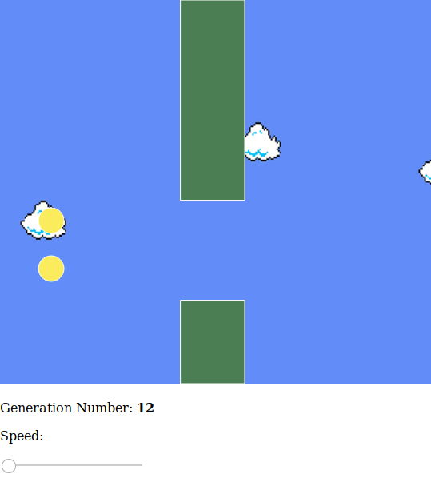
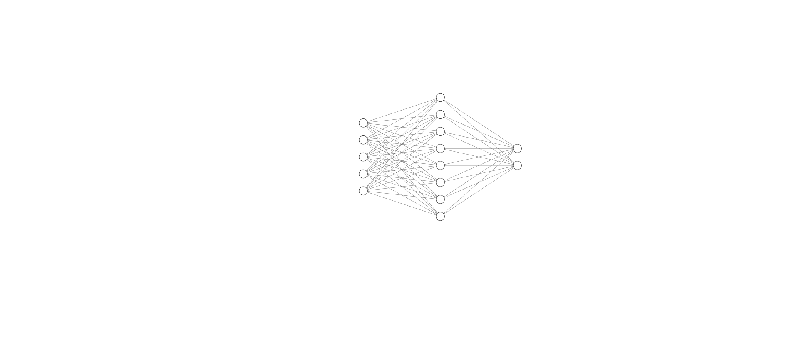

# Flappy Birds with genetic algorithm 🐣 🐥 🐦
## Simulation of Flappy Birds game using a simple neural network and genetic evolution strategy

## How does it work?
We create a large population of birds that try to fly over the pipes. When all of them have died (crashed against the pipes) we copy the **brain** of the bird that went further and create another generation with that brain and some mutation (changes). We repeat it over and over until we get one or several birds that do not crash against the pipes.

The brain of each bird is a simple neural network with 5 input nodes, one hidden layer with 8 nodes and the output layer with 2 nodes and softmax as activation function *(jump or not to jump)*

[Go to live demo](https://mrm8488.github.io/flappy_birds_genetic_evol/index.html)

### Network diagram:

